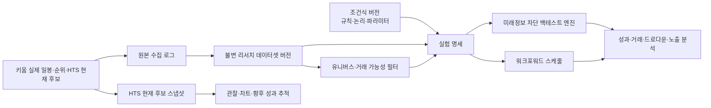

# 키움 퀀트 대시보드 리서치 우선 재구성안

**작성일:** 2026-08-13  
**목적:** 실시간 주문 실행이 아니라, 실제 국내 주가 흐름 위에서 조건식을 조합하고 동일한 실험을 재현하며 백테스트·워크포워드 분석을 반복하는 연구 플랫폼으로 전환한다.

## 1. 제품의 중심을 바꾼다

이 제품의 핵심 질문은 “지금 주문을 보낼 수 있는가”가 아니라 **“이 조건식이 어떤 시장·기간·유니버스·비용 가정에서 어떤 결과를 반복적으로 냈는가”**다. 따라서 주문·계좌·체결은 메인 내비게이션의 중심이 아니라 향후 선택적으로 연결할 수 있는 보조 영역으로 옮긴다. 메인 화면과 데이터 구조는 조건식 설계, 실제 가격 데이터셋, 재현 가능한 실험, 성과 비교, 워크포워드 검증에 집중한다.

| 기존 중심 | 전환 후 중심 |
|---|---|
| OAuth·지정 단말·주문 가능 여부 | 데이터셋 준비 상태·실험 재현성·검증 품질 |
| 조건 충족 종목을 주문 후보로 표시 | 조건 충족 종목을 연구 후보·관찰 유니버스로 표시 |
| 단일 백테스트 결과 | 조건식·기간·유니버스·가정별 실험 이력과 비교 |
| 자동매매 안전 게이트 | 미래정보 차단·데이터 출처·비용·체결 가정·재현성 게이트 |
| 계좌/체결 대시보드 | 인샘플·아웃오브샘플·워크포워드 성과 대시보드 |

> **핵심 원칙:** 실제 주가 데이터가 없으면 어떤 수익률·랭킹·승률도 표시하지 않는다. 모든 숫자는 데이터셋 버전과 실험 설정을 통해 다시 계산할 수 있어야 한다.

## 2. 제품 범위와 우선순위

### 2.1 제1 우선순위: 조건식 연구 스튜디오

현재의 영웅문형 조건 빌더를 제품의 중심으로 둔다. MACD, 이동평균, 고가 등락률, 거래대금 조건, 비교 연산, 기간, 단위, AND·OR·NOT 논리 그룹, 가중치는 유지한다. 여기에 “실험으로 저장” 기능을 추가해 조건식의 버전과 데이터·평가 가정을 함께 고정한다. 조건을 수정하면 새 전략 버전이 생성되어 이전 결과를 덮어쓰지 않는다.

### 2.2 제2 우선순위: 실제 데이터셋 카탈로그

연구 결과의 가장 작은 단위는 화면의 현재 상태가 아니라 **불변 데이터셋 버전**이다. 한 데이터셋은 종목 유니버스, 기간, 일봉 수, 조정주가 처리, 결측·중단 종목 처리, 수집 시각, 원천 API 응답 식별자를 보존한다. 백테스트는 반드시 특정 데이터셋 버전만 참조한다.

### 2.3 제3 우선순위: 백테스트와 워크포워드

단일 기간의 높은 수익률보다 시간 분할을 통한 견고성을 우선한다. 인샘플 구간에서 조건식과 파라미터를 설계한 뒤, 보이지 않은 아웃오브샘플 구간에서 한 번만 평가한다. 워크포워드는 이 과정을 롤링 윈도로 반복하고 구간별 결과를 분리해 보여준다.

### 2.4 보조 영역: HTS 조건식과 실거래

영웅문4에서 만든 조건식은 OAuth 기반 API가 연결된 뒤 **현재 후보 유니버스와 워크포워드 관찰 기록**으로 사용한다. 현재 후보 조회 결과를 과거 조건 충족 이력으로 바꾸어 백테스트하지 않는다. 실거래 주문·계좌·체결 기능은 연구 결과를 확인하는 핵심 경로에서 분리하고, 기본적으로 계속 비활성화한다.

## 3. 목표 아키텍처

### 3.1 데이터 계층

| 계층 | 보존할 정보 | 연구상 역할 |
|---|---|---|
| 원본 수집 로그 | API 이름, 요청 시각, 응답 식별자, 오류, 연속조회 키 | 수집 실패와 데이터 변형을 추적 |
| 일봉 데이터셋 | 종목·거래일·OHLCV·거래대금·조정 기준 | 차트·신호·백테스트의 공통 입력 |
| 유니버스 버전 | 편입 종목, 시장 구분, 관리/거래정지 제외 기준, 적용 기간 | 생존자 편향을 줄이는 기준 |
| HTS 현재 후보 스냅샷 | 조건식 번호·이름·수집 시각·후보 종목 | 워크포워드 관찰용, 과거 백테스트 입력 금지 |
| 연구 데이터셋 버전 | 위 데이터의 조합, 수집 완료 시각, 품질 상태 | 한 실험이 참조한 정확한 입력 고정 |

실제 일봉 데이터는 키움 `ka10081` 계약을 표준 입력으로 유지한다. HTS 조건식 목록과 현재 후보는 각각 `CNSRLST`, `CNSRREQ` 계약을 사용하되, 현재 후보는 시점 스냅샷으로만 저장한다. [1] [2] [3]

### 3.2 조건식과 실험 계층

각 실험은 아래 항목을 하나의 불변 명세로 저장한다.

| 항목 | 예시 | 재현성 이유 |
|---|---|---|
| 전략 버전 | `momentum-v7` | 규칙·가중치·논리 구조를 고정 |
| 데이터셋 버전 | `krx-daily-2026-08-13-r3` | 어떤 가격·유니버스를 썼는지 고정 |
| 관찰 기간 | 2021-01-01 ~ 2025-12-31 | 기간 선택 편향을 추적 |
| 훈련/검증 분할 | 2021–2023 / 2024–2025 | 인샘플 최적화와 검증 결과 분리 |
| 신호 규칙 | 종가·거래량·MACD 기준 | 진입 시점과 사용 가능 정보 고정 |
| 체결 가정 | 다음 거래일 시가, 최대 보유 5일 | 같은 신호를 같은 방식으로 체결 |
| 비용 가정 | 수수료·세금·슬리피지 | 수익률 과대평가 방지 |
| 제외 규칙 | 결측, 거래정지, 상장폐지 처리 | 종목 선택 규칙을 명시 |

### 3.3 평가 계층

최소 성과표는 총수익률만 보여주지 않는다. 연환산 수익률, 최대낙폭, 승률, 손익비, 거래 수, 평균 보유일, 노출일 비율, 월별 수익률, 종목·섹터 집중도, 비용 전후 성과를 함께 표시한다. 각 지표에는 해당 실험 ID, 데이터셋 ID, 계산 기간이 항상 붙는다.

## 4. 반드시 적용할 검증 규칙

### 4.1 미래정보 차단

어떤 거래일의 진입 판단에도 그 시점 이후의 종가·거래량·조건 충족 여부를 쓰지 않는다. 신호가 일봉 종가로 확정되면 가장 빠른 실행 가정은 다음 거래일 이후여야 하며, 실험 명세에 신호 시점과 체결 시점을 분리해 기록한다. 정보 절단 시점과 성과 평가 구간 사이에는 최소 한 거래일의 간격을 둔다. [4]

### 4.2 생존자 편향과 유니버스 편향

현재 상장 종목만으로 과거 기간을 평가하면 상장폐지·거래정지 종목이 빠질 수 있다. 처음에는 데이터 제공 범위의 제약을 명시하고, 이후에는 일자별 유니버스 스냅샷과 제외 사유를 데이터셋에 저장한다. 결과 화면에는 “유니버스가 현재 구성인지, 시점별 구성인지”를 표시한다.

### 4.3 비용과 체결 가정

백테스트는 신호 정확도와 수익 가능성을 구분한다. 거래비용, 세금, 최소 호가·체결 지연, 거래대금 대비 주문 규모 같은 가정은 한 곳에서 관리하고 실험마다 잠금한다. 기본 가정은 사용자가 변경할 수 있지만, 변경 뒤에는 새 실험 버전으로 저장한다.

### 4.4 데이터 품질 게이트

데이터셋에 결측 거래일, 중복 봉, 고가·저가 역전, 음수 거래량, 연속조회 중단이 있으면 연구 실행을 멈추고 오류를 표시한다. 품질 상태가 `ready`인 데이터셋만 백테스트 입력으로 허용한다.

## 5. 화면 정보 구조

| 화면 | 목적 | 핵심 구성 |
|---|---|---|
| **연구 홈** | 현재 연구 상태를 한눈에 파악 | 최신 데이터셋, 최근 실험, 워크포워드 상태, 데이터 품질 경고 |
| **조건식 연구실** | 조건 조합과 전략 버전 관리 | 영웅문형 빌더, 논리 구조, 파라미터, 전략 버전 비교 |
| **데이터셋·유니버스** | 실주가 입력을 명시적으로 관리 | 수집 기간, 종목 수, 결측, 조정 기준, 데이터 버전 |
| **백테스트 스튜디오** | 단일 실험 실행과 드릴다운 | 기간·비용·체결 가정, 성과표, 거래 목록, 수익 곡선 |
| **워크포워드 랩** | 반복 검증 | 훈련/검증 창, 롤링 결과, 구간별 성과 안정성 |
| **HTS 조건 관찰** | 현재 조건 후보를 관찰 | 조건식 목록, 현재 후보 스냅샷, 이후 N일 성과 추적 |
| **비교 보드** | 실험 간 성과 비교 | 동일 데이터셋 기준의 조건식·파라미터 비교 |
| **실거래 기능** | 비핵심·기본 잠금 | 기존 주문 안전 코드 보존, 연구 화면과 분리 |

## 6. 기존 구현의 재사용과 변경

| 이미 구현된 자산 | 전환 후 역할 |
|---|---|
| 영웅문형 조건 빌더와 재귀 논리 그룹 | 전략 정의·버전 관리의 중심 |
| 조건 엔진과 평가 근거 | 신호 검증·규칙별 기여도 설명 |
| 일봉 정규화와 차트 | 연구 데이터셋·드릴다운 차트 |
| 백테스트 엔진·결과 저장 | 실험 실행기, 재현성 메타데이터 보강 대상 |
| 랭킹·유니버스·예약 갱신 | 후보 유니버스와 데이터 수집 작업 |
| HTS 조건식 계약·현재 후보 스냅샷 | 워크포워드 관찰 기능의 기반 |
| 주문 안전 게이트 | 기본 잠금 상태의 보조 모듈 |

## 7. 구현 순서

### 단계 A — 연구 모드 전환

실거래 실행 메뉴를 기본 탐색에서 분리하고, 대시보드 용어를 “주문 후보” 대신 “연구 후보”로 바꾼다. 연구 홈과 백테스트 스튜디오를 첫 화면 흐름으로 지정한다. 기존 주문 안전 기능은 제거하지 않고 기본 잠금 상태로 보존한다.

### 단계 B — 재현 가능한 데이터셋과 실험 명세

`research_datasets`, `universe_versions`, `strategy_versions`, `experiment_runs`, `walk_forward_runs` 중심의 스키마를 추가한다. 기존 백테스트 실행에는 데이터셋 ID, 전략 버전 ID, 비용·체결 가정, 정보 절단 시점, 코드 버전을 저장한다.

### 단계 C — 백테스트 품질 강화

다종목 유니버스, 동시 보유 수, 포지션 크기 규칙, 다음 봉 체결, 비용, 현금 관리, 거래 로그를 추가한다. 인샘플·아웃오브샘플 분할과 워크포워드 실행은 이 단계에서 구현한다.

### 단계 D — 분석과 비교

수익 곡선, 드로다운, 월별 히트맵, 거래별 분포, 규칙별 기여도, 실험 비교표를 추가한다. 실험 비교는 동일 데이터셋·동일 비용 가정 안에서만 기본 비교가 가능하도록 제한한다.

### 단계 E — HTS 조건식 관찰

지정 단말 OAuth 인증이 확인되면 HTS 조건식 목록과 현재 후보 스냅샷을 읽기 전용으로 연결한다. 후보별 수집 후 1·5·20거래일 성과는 **그 시점 이후에 축적된 관찰 데이터**로만 계산한다.

## 8. 성공 기준

리서치 우선 전환은 다음 조건을 만족하면 완료로 판단한다.

1. 하나의 실험에서 전략 버전, 데이터셋 버전, 기간, 유니버스, 체결·비용 가정, 결과가 함께 저장된다.
2. 동일 실험 ID를 다시 실행해 동일 입력에서 같은 결과를 재현할 수 있다.
3. 미래 정보 사용, 결측 데이터, 불완전한 유니버스, 비용 누락이 감지되면 실행이 중단되거나 명시적으로 경고된다.
4. HTS 조건식 현재 후보는 워크포워드 관찰로만 표시되며, 과거 백테스트 결과와 혼합되지 않는다.
5. 주문·계좌 기능은 연구 결과나 조건 충족만으로 자동 활성화되지 않는다.

## 9. 다음 의사결정

첫 구현 단계에서는 **기존 키움 실데이터만 원천으로 유지**한다. 지정 단말 인증이 해결되기 전에는 실제 가격·백테스트 수치를 새로 만들지 않는다. 이후 데이터 수집 범위가 장기 과거 구간·전 종목 유니버스까지 확대되어야 할 때는, 키움 데이터 제공 범위와 별도로 사용할 공인 데이터 원천을 먼저 명시적으로 선택한다. 원천이 바뀌면 실험 결과의 데이터셋 ID와 표시 문구도 반드시 달라져야 한다.

> 이 문서는 제품·연구 설계안이며, 투자 판단이나 수익을 보장하지 않는다.

## References

[1] [키움 REST API — 일봉차트조회 ka10081](https://openapi.kiwoom.com/m/guide/apiguide?jobTpCode=05&apiId=ka10081)

[2] [키움 REST API — 조건검색 목록조회 ka10171](https://openapi.kiwoom.com/m/guide/apiguide?jobTpCode=15&apiId=ka10171)

[3] [키움 REST API — 조건검색 요청 일반 ka10172](https://openapi.kiwoom.com/m/guide/apiguide?jobTpCode=15&apiId=ka10172)

[4] [Finance Pro Playbooks — Backtesting minimums](../../skills/finance-pro-playbooks/SKILL.md)
